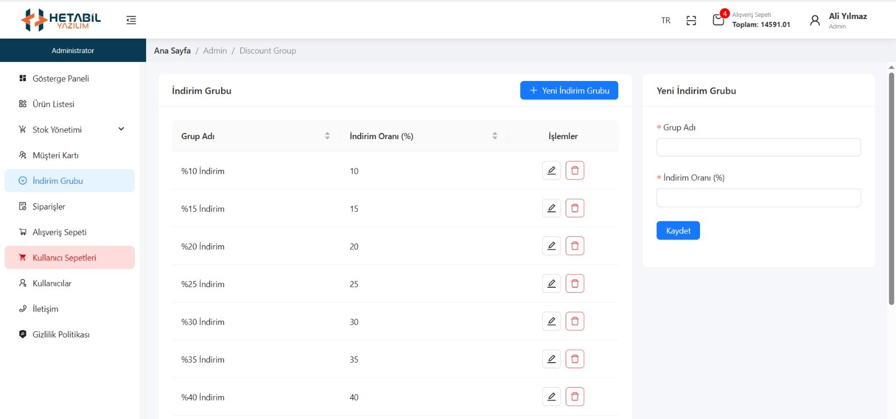
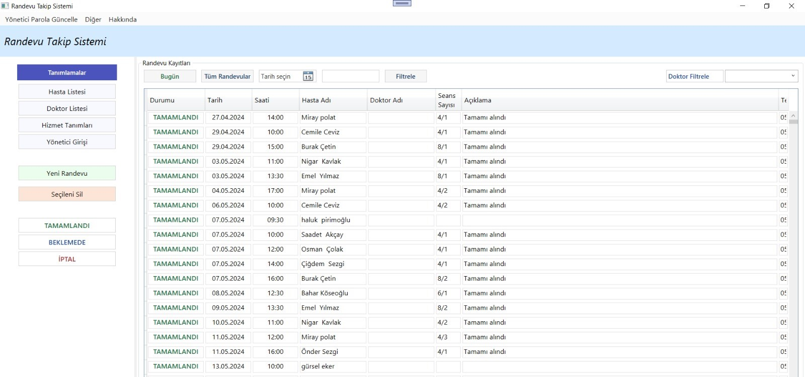
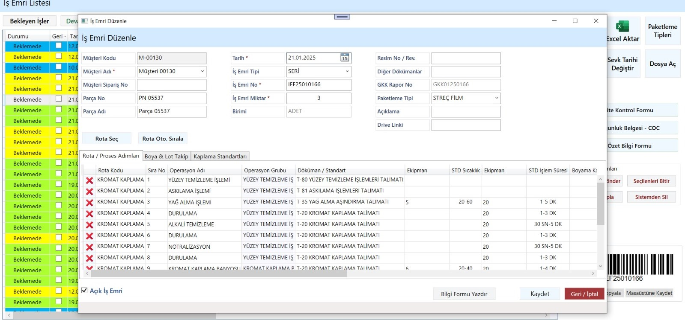
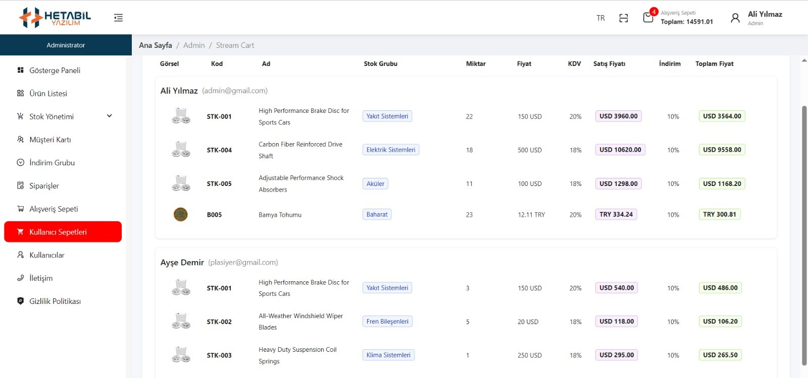
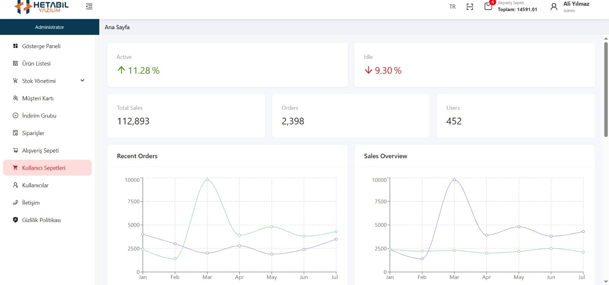
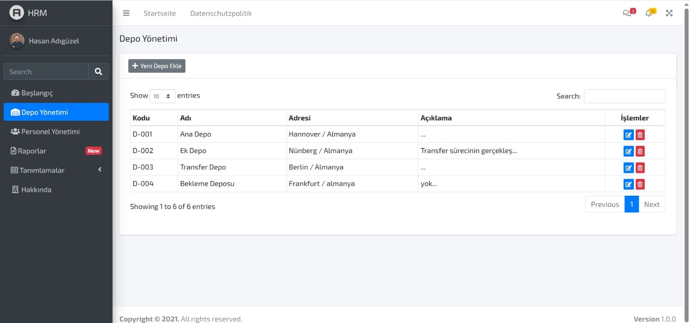
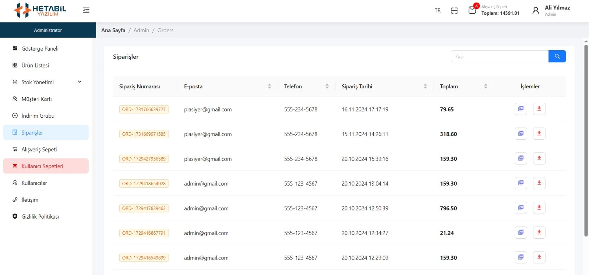
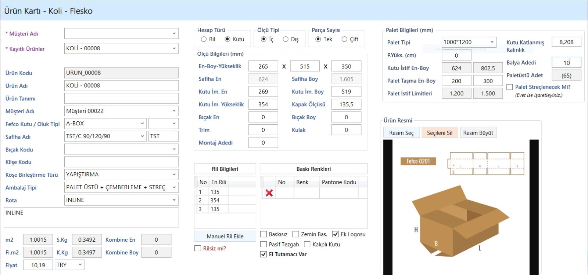

# STDERP — Defense Industry Process Tracking Software: Showcase Page


**STDERP** is a process tracking software developed by **Hetabil Yazılım** that lets companies in the defense industry manage their production, procurement and operations end to end, in line with MIL and ISO standards.

This repository contains the **showcase (landing) page** of STDERP. The page introduces the software's purpose, modules, reporting capabilities and standards compliance to visitors. The project was developed during an internship at Hetabil Yazılım.

> **Note:** This repository does not contain the source code of the STDERP application itself, only the static web page that presents it.

---

## Table of Contents

1. [What's on the page?](#1-whats-on-the-page)
2. [Screenshots](#2-screenshots)
3. [Technologies used](#3-technologies-used)
4. [Project structure](#4-project-structure)
5. [Installation and running](#5-installation-and-running)
6. [Customizing the page](#6-customizing-the-page)
7. [Contact](#7-contact)

---

## 1. What's on the page?

From top to bottom, the page consists of the following sections:

| # | Section | Content |
|---|---------|---------|
| 1 | **Top bar and menu** | Contact details (email, phone, location), the Hetabil logo and links to Home / Services / Projects / Contact |
| 2 | **Project title and intro** | A one-paragraph introduction to STDERP |
| 3 | **Strategic Processes, Smart Management** | 4 feature cards: Integrated Process Management, Quality & Standards Compliance, Full Traceability and Reporting, Customizable Modules |
| 4 | **Images from the Project** | A carousel of 8 images that advances automatically every 3 seconds |
| 5 | **Modular Structure** | Card view of the 12 modules |
| 6 | **Compliance with International Standards** | Emphasis on MIL-STD and ISO 9001 |
| 7 | **24 Different Report Types** | All supported report titles |
| 8 | **Contact and footer** | Email, address, phone and copyright notice |

### The 12 modules of the software

1. **Basic Definitions** — master data such as customers/suppliers, personnel, machines, materials and tools
2. **Quotation** — cost calculation, feasibility analysis, converting quotations into orders
3. **Orders** — recording and tracking customer orders
4. **Purchasing** — material/service requests and supplier correspondence
5. **Stock** — warehouse and stock movements, automatic purchase triggering at critical stock levels
6. **Work Order Preparation** — production orders, routing and bill-of-materials management
7. **Quality** — incoming inspection, nonconformity management, measurement tracking, calibration, supplier scoring
8. **Shipping** — shipping orders, delivery notes and delivery records
9. **Subcontracting** — tracking parts sent out for external operations
10. **Production Data Entry** — job start, job finish and scrap entry from the shop floor
11. **Equipment Management** — tracking of cutting tools, fixtures, holders and molds
12. **Reports** — analysis by order, production, quality, cost, personnel and machine

### 24 report types

<details>
<summary>Show all report titles</summary>

- Quotation Performance Report
- Order Performance Report
- Purchasing Performance Report
- Parts at Subcontractors Report
- Shipping List
- Overproduced Parts Report
- Open/Closed Orders List
- Ongoing Operations List
- Completed Operations List
- Estimated Cost Report
- Scrap Reason Distribution Report
- Capacity Report
- Parts Awaiting Inspection
- Supplier Evaluation
- Personnel Work Report
- Personnel Total Work by Day
- Personnel Total Work by Year-Month
- Machine Work Report
- Live Machine Status List
- Defective Parts – Scrap Report
- Cutting Tools Held by Personnel List
- Open Orders Revenue Report
- Historical Price Analysis Report
- Part Material Query

</details>

---

## 2. Screenshots

The images used in the "Images from the Project" section are located in `images/project-examples/`.

| | | |
|---|---|---|
|  |  |  |
|  |  |  |
|  |  | |

---

## 3. Technologies used

| Technology | Purpose |
|------------|---------|
| **HTML5** | Page skeleton (semantic tags such as `header`, `main`, `section`, `footer`, `address`) |
| **CSS3** | Custom styles: gradients, card layouts, flexbox, fixed top bar (`style.css`) |
| **Bootstrap 5.3.8** | CSS and JS bundle for the carousel component (via CDN, jsDelivr) |
| **Google Fonts** | *Inter* and *Space Grotesk* typefaces |

There is no build step, package manager or backend; the page runs directly in the browser.

---

## 4. Project structure

```text
STDERP/
├── index.html                  # Single page: all content lives here
├── style.css                   # Custom stylesheet
├── README.md                   # Turkish documentation
├── README.en.md                # English documentation
└── images/
    ├── favicon.png             # Browser tab icon and footer logo
    ├── HETABIL-RENKLI.svg      # Hetabil logo (top menu)
    ├── title-background.png    # Background of the title area
    ├── studio-picture.png      # Image for the "Compliance with International Standards" section
    └── project-examples/       # Carousel images
        ├── example1.jpeg
        ├── ...
        └── example8.jpeg
```

---

## 5. Installation and running

No extra setup is required. Pick one of the methods below.

### Method A — Open directly in the browser (fastest)

1. Clone the repository:
   ```bash
   git clone https://github.com/berkaycinar-dev/STDERP.git
   ```
2. Go into the project folder:
   ```bash
   cd STDERP
   ```
3. Double-click `index.html` or drag it into your browser.

### Method B — Run with a local server

1. Clone the repository and enter the folder (Method A, steps 1–2).
2. Start a simple server in the folder (if Python is installed):
   ```bash
   python -m http.server 8000
   ```
3. Open `http://localhost:8000` in your browser.

### Method C — VS Code Live Server

1. Open the folder in VS Code.
2. Install the **Live Server** extension.
3. Right-click `index.html` and choose **Open with Live Server**.

> **An internet connection is required:** Bootstrap (CSS and JS) and Google Fonts are loaded from a CDN. Offline, the page renders without the fonts and Bootstrap styles.

---

## 6. Customizing the page

| What you want to do | Where to edit |
|---------------------|---------------|
| Change the title and intro text | `index.html` → `project-info` section |
| Edit the feature cards | `index.html` → `info-cards` section |
| Add or remove a module | `index.html` → the `card` blocks inside `modul-card-container` |
| Update the report list | `index.html` → the `reporting-type` blocks inside `reporting-types` (also update the "24" in the heading) |
| Replace a carousel image | Replace the file under `images/project-examples/` with the same name |
| Change the carousel speed | `index.html` → `data-bs-interval` on `#carouselExample` (milliseconds) |
| Update contact details | `index.html` → top bar (`address`), `contact` and `footer` sections |
| Change colors and spacing | `style.css` |

---

## 7. Contact

To explore STDERP in detail or to request customizations for your company, get in touch with **Hetabil Yazılım**.

- **Email:** [info@hetabil.com](mailto:info@hetabil.com)
- **Phone:** +90 312 911 12 57
- **Address:** İvedik OSB Mah. 2224. Cad. No:1/116, Yenimahalle / Ankara — Teknopark Ankara TGB Campus
- **Web:** [hetabil.com](https://hetabil.com)

© Hetabil Yazılım 2022 – 2026. All rights reserved.
